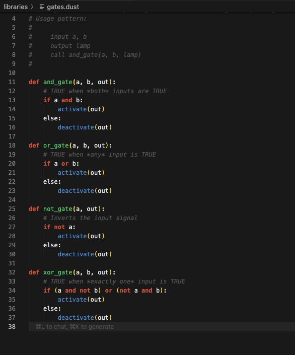

# CoralSnake 🐍

## A DSL for Minecraft Redstone

CoralSnake is a simple Domain Specific Language (DSL) designed to describe Redstone logic in Minecraft. The goal is to write `.dust` files using CoralSnake syntax, and eventually have an interpreter generate step-by-step build instructions or schematics for the described contraption.

<details>
<summary>📦 Current Status (v0.4 - Parsing & Execution)</summary>

*   **Parsing:** The interpreter (`coral.py`) now supports inputs, outputs, variables, parameterized functions (with parameters) and argument-passing in calls, along with control flow and action statements.
*   **Standard Library:** You can define and call reusable functions across `.dust` files (e.g., logic gate libraries and imports).
*   **Structure Output:** Prints a structured view of the parsed program with clear indentation and command sequencing.
*   **Material Estimation:** Provides a basic estimate of required Redstone components based on the parsed commands.
*   **Execution Notes:** Outputs execution notes showing function signatures, steps, and call arguments. Full simulation logic (state changes, loops, timing) is still under development.

</details>

## Syntax

The language syntax is defined in [`docs/SYNTAX.md`](docs/SYNTAX.md). It uses indentation for structure and aims for readability.

## Usage

To parse a CoralSnake file and see the parsed structure and estimated materials:

```bash
python coral.py <your_file.dust>
```

Example:
```bash
python coral.py examples/clock.dust
```

<details>
<summary>🚀 Getting Started</summary>

To run the CoralSnake parser, make sure you have Python 3 installed. Then from your terminal:

1. Install Python:
   - Windows: Download and install from [Python.org](https://www.python.org/downloads/)
   - Mac: Use Homebrew: `brew install python3`
   - Linux: Python is usually pre-installed, or use: `sudo apt install python3`

2. Download CoralSnake:
   ```bash
   # Clone the repository (HTTPS)
   git clone https://github.com/TitaniteScale/coralsnake.git

   # Or clone via SSH:
   git clone git@github.com:TitaniteScale/coralsnake.git

   # Go into the project folder
   cd coralsnake
   ```

3. You're ready to run CoralSnake!

```bash
python3 coral.py your_file.dust
```

This will display the parsed structure and an estimate of Redstone components needed.

</details>

## VS Code Extension

CoralSnake has an official [Visual Studio Code extension](https://marketplace.visualstudio.com/items?itemName=TitaniteScale.coralsnake) for syntax highlighting and language support.

## Icon


To install:
- Search for "CoralSnake" in the VS Code Extensions Marketplace, or
- Install directly using the `.vsix` if downloaded locally.

## Snippets

**Example Code (clock.dust):**



```

**Interpreter Output:**
```


## Examples / Demos

Basic examples can be found in the `examples/` directory.

**(More detailed examples and demos demonstrating generated build instructions are planned for future versions!)**

<details>
<summary>🧪 Future Work</summary>

*   Implement the execution engine to simulate the Redstone logic.
*   Develop the build instruction generation based on parsed and executed logic.
*   Potentially add support for schematic generation (.litematic, .schem).
*   Refine syntax and add more advanced Redstone concepts.

</details>

## License

This project is licensed under the MIT License - see the [`LICENSE`](LICENSE) file for details.
